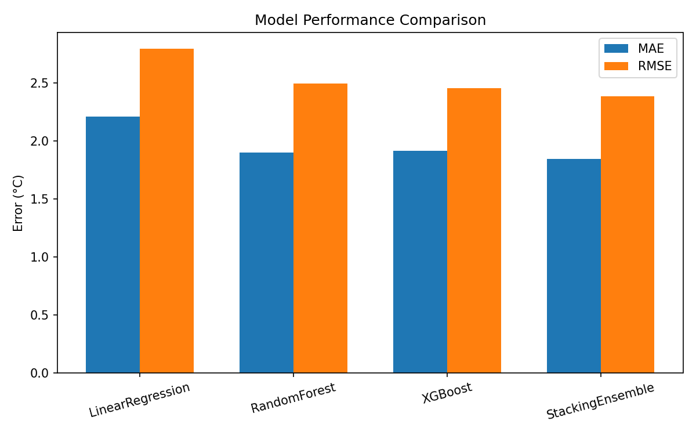
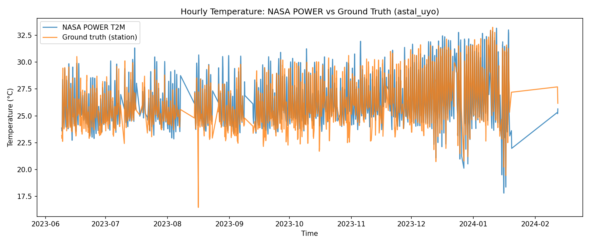
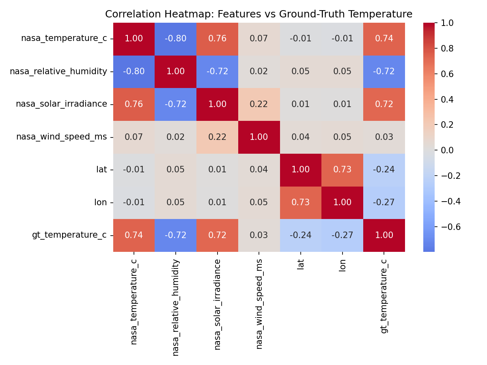
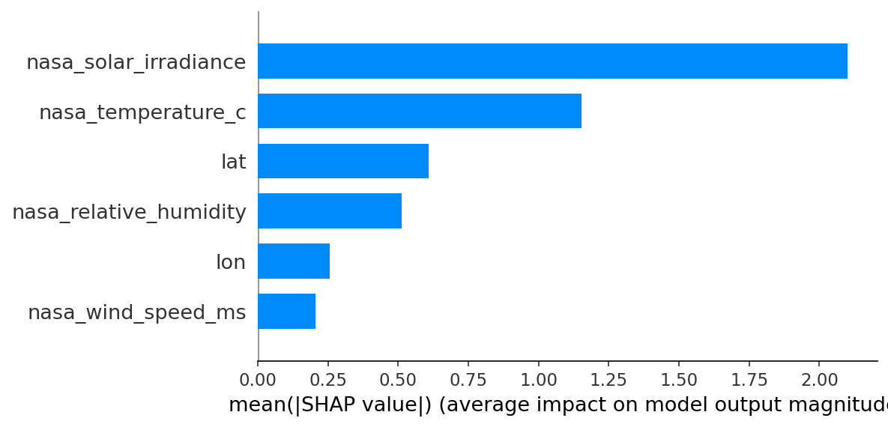
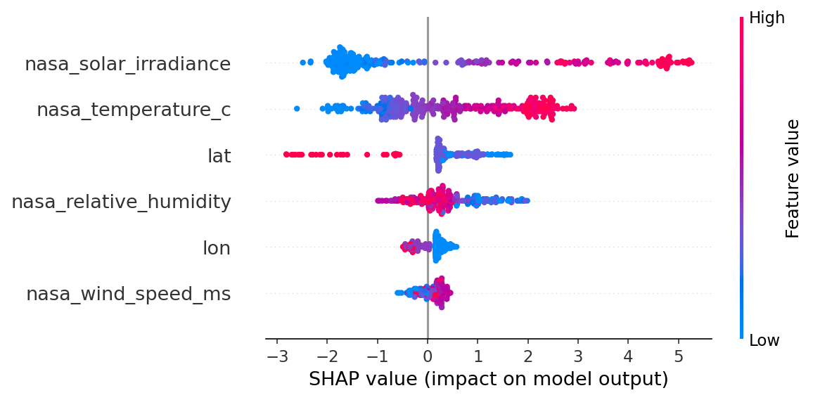

# NASA POWER Ground-Truth Calibration — Spatio-Temporal ML Pipeline

Calibrating NASA's satellite-based **POWER** (Prediction of Worldwide Energy
Resources) hourly weather reanalysis against ground-truth IoT weather station
measurements, using machine learning, for four sites in the Akwa Ibom region
of Nigeria.

NASA POWER makes meteorological estimates available for any point on Earth,
but these are satellite/reanalysis-derived and can diverge from what's
actually measured on the ground. This project builds a spatio-temporal
pipeline that:

1. **Retrieves & aligns data** — hourly NASA POWER records (temperature,
   relative humidity, solar irradiance, wind speed/direction) matched against
   four IoT ground-truth weather stations streaming sensor data roughly every
   15 minutes.
2. **Cleans & engineers features** — resamples ground-truth data to hourly
   means; identifies genuine sensor outages (some spanning days-to-weeks in
   this dataset) versus brief drop-outs, linearly interpolating only short
   gaps (≤3 consecutive hours, flagged via `gt_interpolated`) and dropping
   rows that fall in longer real outages rather than fabricating them.
3. **Analyzes** — descriptive time-series comparison and a correlation
   heatmap to identify which NASA-derived variables best explain ground-truth
   temperature.
4. **Predicts** — trains Linear Regression, Random Forest, and
   GridSearchCV-tuned XGBoost models, plus a stacking ensemble
   (XGBoost + Random Forest + Linear Regression, with a Linear Regression
   meta-learner), evaluated on a chronological 80/20 train/test split using
   **MAE, MSE, RMSE, and R²**.
5. **Explains** — uses SHAP (SHapley Additive exPlanations) to attribute the
   best model's predictions to individual input features, both globally
   (feature importance) and for individual predictions.

## Results

| Model | MAE (°C) | MSE | RMSE (°C) | R² |
|---|---|---|---|---|
| Linear Regression | 2.21 | 7.80 | 2.79 | 0.636 |
| Random Forest | 1.90 | 6.22 | 2.49 | 0.710 |
| XGBoost (tuned) | 1.91 | 6.00 | 2.45 | 0.720 |
| **Stacking Ensemble** | **1.84** | **5.67** | **2.38** | **0.735** |

The stacking ensemble gives the best calibration accuracy on every metric.

> **Data-quality note:** ground-truth sensor logs contain real outages —
> some lasting days to weeks — not just brief drop-outs. An earlier version
> of this pipeline linearly interpolated across *any* size gap, which for
> gaps at the start of a station's series degenerated into flat-filling
> hours with a single carried-forward value (fabricated, not measured). The
> pipeline now interpolates only short gaps (≤3 hours) and drops rows inside
> longer outages — cutting the dataset from ~25k to ~17.9k genuine rows, and
> **improving** every model's R² substantially (stacking ensemble: 0.40 →
> 0.735), since the fabricated flat/linear stretches were diluting the real
> signal, not just adding harmless noise.





### Model explainability (SHAP)




NASA's own solar irradiance and temperature readings dominate the calibrated
prediction, followed by station latitude/longitude (capturing site-specific
offsets) and relative humidity (negative effect, matching the correlation
analysis).

## Project structure

```
├── data/
│   ├── raw/                     # per-station NASA POWER + ground-truth CSVs
│   └── processed/                # merged, cleaned hourly dataset
├── models/
│   └── best_model.pkl            # persisted best pipeline (model + scaler)
├── notebooks/
│   └── temperature_calibration_pipeline.ipynb   # full walkthrough, executed
├── reports/
│   ├── model_results.json
│   └── figures/
├── src/
│   ├── data_pipeline.py          # retrieval, resampling, cleaning, merging
│   ├── eda.py                    # descriptive/correlation analysis + plots
│   ├── modeling.py                # train/evaluate/persist models
│   ├── shap_explain.py             # SHAP explainability (global + per-prediction)
│   └── predict.py                 # minimal inference example
└── requirements.txt
```

## Usage

### Run locally on your PC

```bash
git clone <your-repo-url>
cd nasa-power-temperature-calibration
python -m venv venv
source venv/bin/activate        # Windows: venv\Scripts\activate
pip install -r requirements.txt
```

Then, from the project root:

```bash
# Rebuild the merged dataset from raw station + NASA POWER data
python src/data_pipeline.py

# Regenerate EDA plots
python src/eda.py

# Train all models (Linear Regression, Random Forest, XGBoost, Stacking
# Ensemble), evaluate with MAE/MSE/RMSE/R2, and persist the best pipeline
python src/modeling.py

# Explain the best model's predictions with SHAP
python src/shap_explain.py

# Run a single inference example
python src/predict.py
```

Or open `notebooks/temperature_calibration_pipeline.ipynb` for the full
narrative walkthrough with inline plots.

## Data

- **NASA POWER**: hourly `ALLSKY_SFC_SW_DWN`, `T2M`, `RH2M`, `WS2M`, `WD2M`
  for each station's coordinates (source: [power.larc.nasa.gov](https://power.larc.nasa.gov/)).
- **Ground truth**: IoT weather station sensor logs (temperature, humidity,
  and — for one station — pressure, wind, rainfall, light, UV index),
  recorded roughly every 15 minutes and resampled to hourly means.

## Tech stack

Python · pandas · scikit-learn · XGBoost · SHAP · matplotlib/seaborn · Jupyter

## Notes for running on your own machine

- **Python version**: developed and tested on Python 3.12; anything ≥3.10
  should work.
- **Run order matters** the first time: `data_pipeline.py` must run before
  `eda.py`/`modeling.py` (it produces `data/processed/merged_hourly_dataset.csv`),
  and `modeling.py` must run before `shap_explain.py`/`predict.py` (it
  produces `models/best_model.pkl`). Re-running the notebook top-to-bottom
  does this automatically.
- **SHAP runtime**: `shap_explain.py` explains the stacking ensemble with a
  model-agnostic Permutation/Exact explainer (since it wraps three
  sub-models), which is slower than SHAP's tree-specific explainers. With
  the default 100 background / 300 sample rows it takes under a minute on a
  typical laptop; reduce `background_size`/`sample_size` in
  `shap_explain.explain()` if you want it faster.
- The raw data in `data/raw/` is the exact CSVs you supplied (NASA POWER +
  the 4 IoT station logs); delete/replace them and re-run `data_pipeline.py`
  if you want to extend the date range or add stations.
